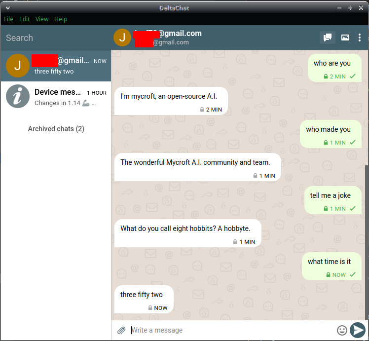

# HiveMind - DeltaChat Bridge

[DeltaChat](https://delta.chat/en/) bridge for the [HiveMind](https://github.com/OpenJarbas/HiveMind-core)




## Install

```bash
$ pip install HiveMind-deltachat-bridge
```
## Usage

```bash
$ hm-deltachat-bridge --help

Options:
  --email TEXT           deltachat email
  --email-password TEXT  deltachat email password
  --key TEXT             HiveMind access key (default read from identity file)
  --password TEXT        HiveMind password (default read from identity file)
  --host TEXT            HiveMind host (default read from identity file)
  --port INTEGER         HiveMind port number (default: 5678)
  --help                 Show this message and exit.
```
